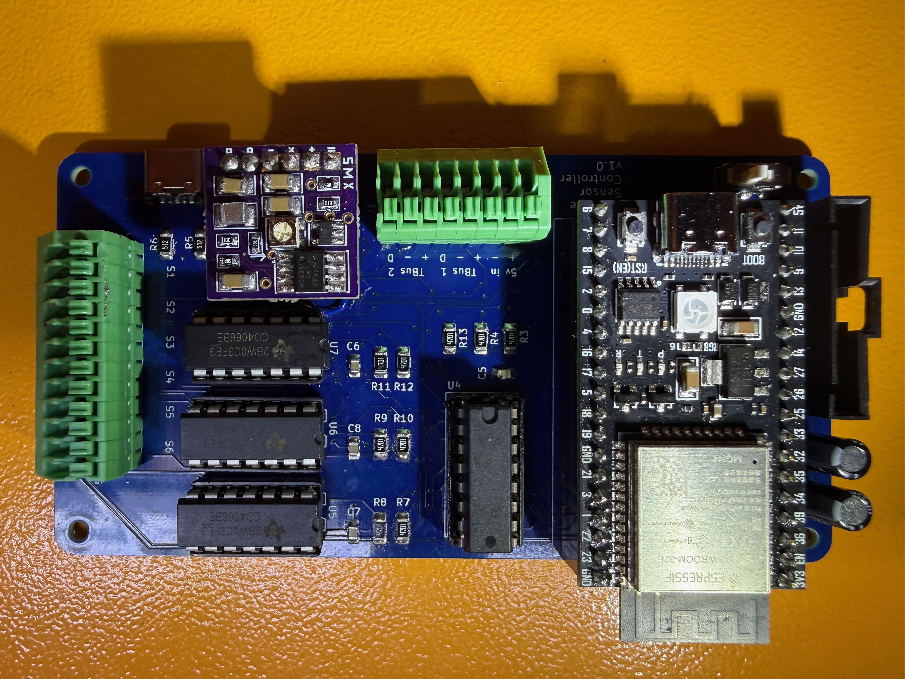
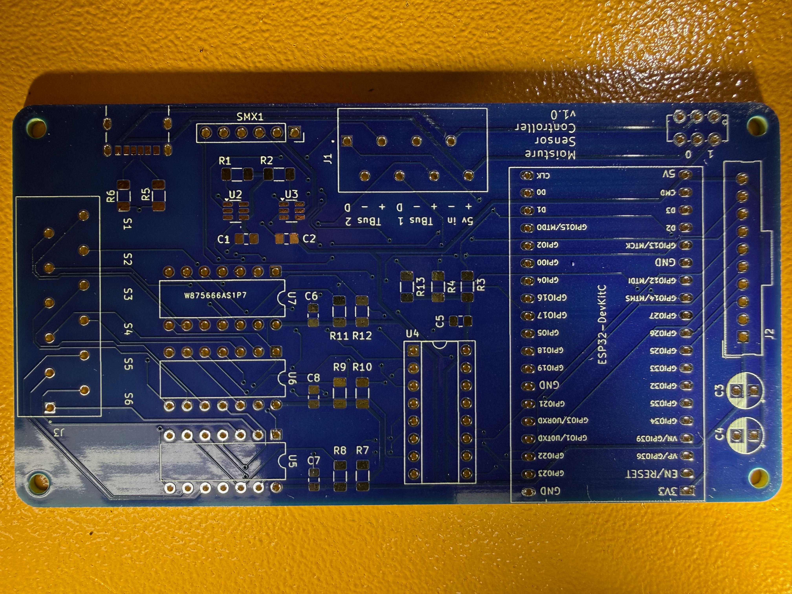

# Moisture Sensor Hardware

KiCad hardware design for ESP32-based soil moisture monitoring system.

## Overview

This repository contains the PCB design and schematics for an irrigation moisture sensor system. The board interfaces with resistance-based moisture sensors ([I recommend Irrometer Watermark Sensors](https://www.irrometer.com/sensors.html)) and DS18B20 temperature sensors.

The board uses an [SMX moisture sensor interface](https://www.emesystems.com/smx/main.html) board to interact with up to 6 moisture sensors. The SMX board transmits AC power to the sensors which substantially reduces mineral accumulation and extends the life of the sensors.  Because moisture sensors are sensitive to temperature, the board also can take in data from DS18B20 temperature sensors through 2 available 1-Wire bus inputs.

The ESP 32 firmware combines moisture sensor and soil temperature outputs to calculate soil tension values for use in irrigation systems.  The firmware can be configured with wifi credentials so the user can access the board's web server which will display sensor values.  The firmware can also be configured with mqtt message server credentials allowing the board to transmit sensor data in formatted json via wifi to your main irrigation controller.  I am using the [SIP controller](https://github.com/Dan-in-CA/SIP) for my main irrigation system.

*Board fabrication done by [PCBWay](https://www.pcbway.com) whom I can't say enough good things about: excellent website, great communication, and outstanding quality.  Their KiCad plugin makes design file uploads super easy.

## Firmware

Firmware for this hardware is available in a separate repository:
**[moisture-sensor-esp32](https://github.com/IMHarris/moisture-sensor-esp32)**

## Design Files

- **`MoistureSensor1.kicad_pro`**: KiCad project file
- **`MoistureSensor1.kicad_sch`**: Schematic design
- **`MoistureSensor1.kicad_pcb`**: PCB layout
- **`MoistureSensor1BOM.csv`**: Bill of Materials
- **`gerber/`**: Production files for PCB fabrication
- **`parts/`**: Custom component footprints and symbols

## Features

### Microcontroller
- ESP32 DevKit-compatible footprint
- WiFi connectivity for MQTT publishing
- 3.3V logic level

### Sensor Interfaces
- **6x Moisture Sensor Channels**: Relay-controlled power
- **2x OneWire Buses**: For DS18B20 temperature sensors
- **Expansion header**: Output to expand the number of moisture and temperature sensors.

### I/O
- **Moisture Sensors**: 6 channels with relay control
- **Frequency Input**: GPIO 21 (shared)
- **OneWire Buses**: GPIO 13, GPIO 14
- **OneWire Relay Control**: GPIO 12, GPIO 26
- **Status LED**: GPIO 2

### Power
- 5V input via USB or terminal
- 3.3V signal regulation for ESP32
- Relay-switched 5V outputs for moisture and temperature sensors

## Bill of Materials

See `MoistureSensor1BOM.csv` for complete component list.

Key components:
- ESP32 DevKit module.  I've used [this one](https://www.amazon.com/dp/B0D6BH4K9B?ref_=ppx_hzod_title_dt_b_fed_asin_title_0_0&th=1).
- [SMX moisture sensor interface](https://www.emesystems.com/smx/main.html)
- DS18B20 temperature sensors
- Resistance-based moisture sensors (external)
- 5V power supply

## PCB Specifications

- **Layers**: 2-layer PCB
- **Dimensions**: 111x58mm
- **Connectors**: Wire terminals for sensors, USB C or Wire terminals for power

## Manufacturing

Gerber files for PCB fabrication are included in the `gerber/` directory. These can be uploaded to PCB manufacturers like:
- [PCBWay](https://www.pcbway.com) (my favorite)

## Assembly Notes

1. Solder ESP32 DevKit module (or use pin headers for socketing)
2. Install relay modules
3. Connect terminals for sensor interfaces
4. Verify 3.3V and 5V power rails before powering ESP32
5. Flash firmware from [moisture-sensor-esp32](https://github.com/IMHarris/moisture-sensor-esp32)

## Design Software

- **KiCad**: Version 7.0 or later recommended
- Open `MoistureSensor1.kicad_pro` to view/edit the design

## License

This hardware design is licensed under [CC BY-SA 4.0](http://creativecommons.org/licenses/by-sa/4.0/).

You are free to share and adapt this work, provided you give appropriate credit and distribute your contributions under the same license.

## Author

Ian Harris - [GitHub](https://github.com/IMHarris)

## Related Projects

- **Firmware**: [moisture-sensor-esp32](https://github.com/IMHarris/moisture-sensor-esp32)